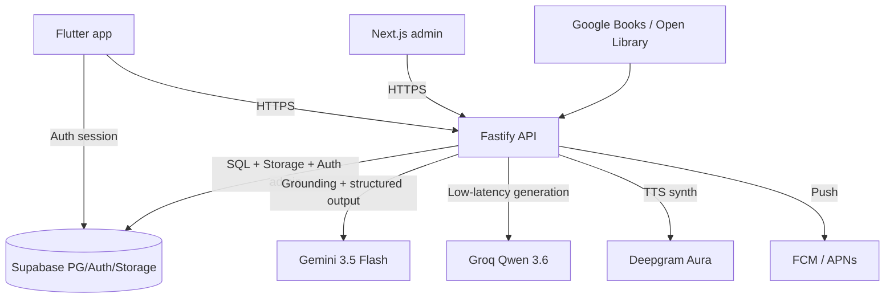

<div align="center">

# 🦉 owlnighter

### _Pull an owl-nighter — build a nightly reading habit._

A Duolingo-style reading-habit platform: add a book, get a paced nightly reading
path, read your pages, take a short quiz to lock in the day, keep your streak
alive, and drift off to a calm audio recap. Book facts are **grounded** with
citations so the app never fakes precision it doesn't have.

</div>

---

> **Status:** early scaffold. This is a real, structured monorepo built from
> [`docs/reading-research.md`](docs/reading-research.md). See
> [`GOAL.md`](GOAL.md) for the live build plan and what is done vs. pending.

## What's in the box

`owlnighter` is a **polyglot monorepo**:

| Path | What it is | Stack |
| --- | --- | --- |
| `apps/mobile` | Reader app | **Flutter** · Riverpod · go_router · drift · Rive/Lottie |
| `apps/admin` | Ops + content QA console | **Next.js** App Router |
| `apps/api` | Authoritative API + AI/workflow layer | **Fastify** + TypeScript |
| `packages/ts/contracts` | Source-of-truth request/response schemas | **Zod → JSON Schema → OpenAPI** |
| `packages/ts/ai` | Provider abstraction | **Gemini** (grounding) · **Groq** (low-latency) |
| `packages/ts/db` | Schema + migrations | **Drizzle** over **Supabase Postgres** + pgvector |
| `packages/ts/jobs` | Scheduled/queued work | TTS pre-gen, reminders |
| `packages/ts/shared` | Cross-cutting utils | logging, ids, env, flags |
| `packages/dart/*` | Shared Dart libs | `app_core`, `api_client`, `design_system`, `offline` |
| `infra/` | SQL, docker, firebase, cloud-run | — |

## Core design decisions

- **Flutter over Expo** — one rendering stack for iOS/Android, full motion control.
- **OpenAPI, not tRPC** — Flutter can't consume TS types; Zod is the contract
  source, converted to JSON Schema/OpenAPI, then codegen'd to **TS + Dart** clients.
- **Two-pass grounding** — deterministic catalog lookup (Google Books + Open
  Library) → **Gemini Search Grounding** reconciliation with citations → persisted
  "truth layer" → **Groq Qwen** does fast downstream generation from grounded facts.
- **Honest quiz modes** — `grounded` · `preview` · `user_text` · `fallback`. The
  app never claims page-specific precision when the evidence is weak.
- **Motion, mapped not copied** — native Flutter animations by default, Rive for
  stateful mascot/reward interactions, Lottie sparingly, `CustomPainter` for the
  reading path. Respects `MediaQuery.disableAnimations`.
- **Keys stay on the backend** — no Gemini/Groq/Deepgram keys ever ship to the client.

## Architecture



## Getting started

```bash
# 1. Install TS deps
pnpm install

# 2. Configure secrets
cp .env.example .env   # fill GEMINI_API_KEY, GROQ_API_KEY, Supabase, ...

# 3. Bring up the API
pnpm dev:api

# 4. Admin (separate terminal)
pnpm dev:admin

# 5. Flutter app (requires the Flutter SDK + Melos)
dart pub global activate melos
melos bootstrap
cd apps/mobile && flutter run
```

## Repo conventions

- **TypeScript** side is a `pnpm` workspace. **Dart/Flutter** side is a `melos`
  workspace. They coexist in one git repo.
- Contracts flow **one direction**: edit Zod in `packages/ts/contracts` → regenerate
  OpenAPI → regenerate clients. Never hand-edit generated clients.
- Every AI call is `model → parse → validate (Zod) → retry/downgrade → persist`.

## License

[MIT](LICENSE) © 2026 Alisher Farhadi
