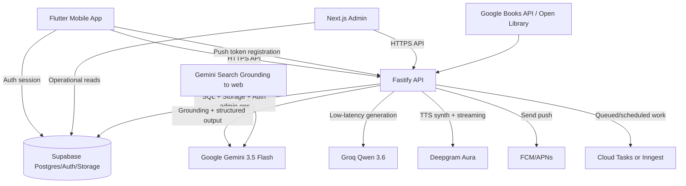
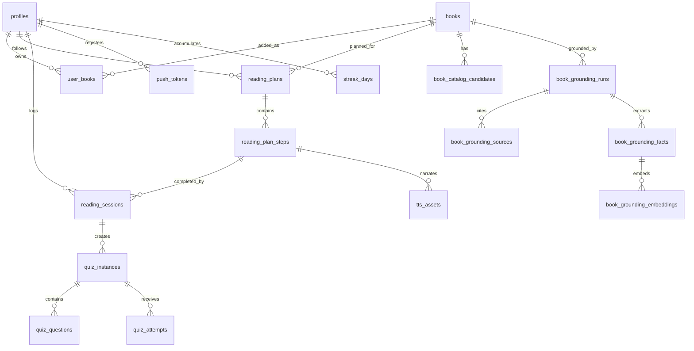
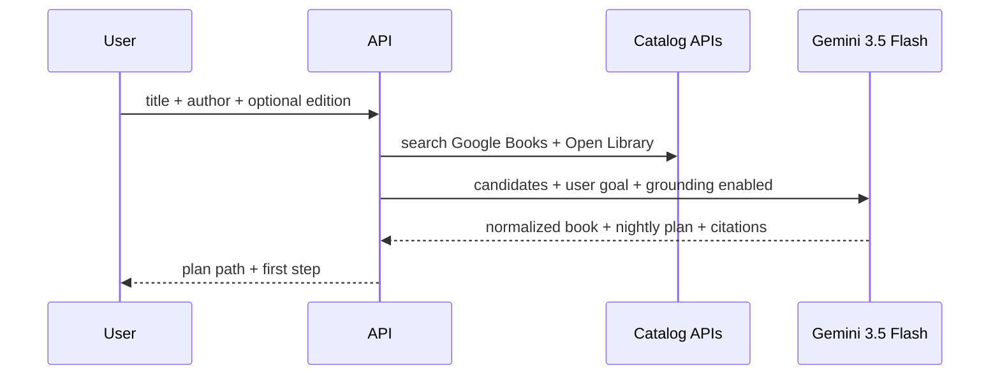
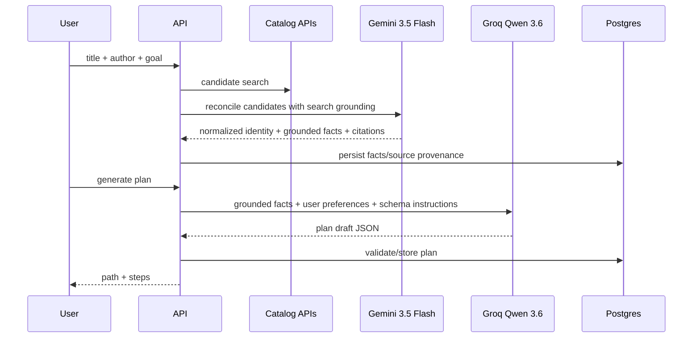
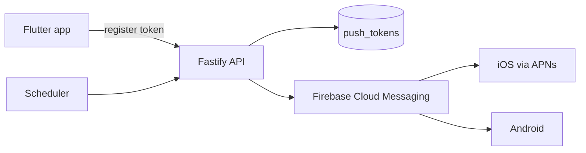

# Flutter Blueprint for the Reading Habit Platform

## Executive summary

The strongest implementation path is a **polyglot monorepo**: a Flutter mobile app for readers, a Next.js admin web app for operations and content QA, and a Node.js API/workflow layer sitting in front of Supabase Postgres. Flutter is the right replacement for Expo here because it gives you one rendering stack for Android and iOS, full control over motion, strong local persistence options, and mature plugin support for push, audio, and native integrations. For the backend, Supabase is a good default because it provides a real Postgres database, Auth, Storage, Realtime, and RLS in one platform, with Flutter support documented directly by Supabase. Google recommends the Gemini **Interactions API** for new Gemini projects as of June 2026, and Gemini Search Grounding is the cleanest answer for book grounding and citation-backed enrichment. Groq should be added as a **selectable low-latency provider**, but with an important caveat: **Qwen 3.6 on Groq supports tool use and JSON object mode, not Groq’s strict schema-constrained Structured Outputs**. That means Gemini should own grounding-heavy and contract-critical flows, while Groq Qwen 3.6 should be used for fast reformulations, lightweight planning, and latency-sensitive generation where app-level validation and retry are acceptable. citeturn10search3turn9search3turn9search16turn9search1turn7search9turn7search2turn8search1turn29view1turn30search1

The other major architectural conclusion is that **page-specific quizzes are only truly reliable if the system has access to the text for those pages**. Gemini Search Grounding and public catalog APIs can help identify books, editions, authors, page counts, previews, and some public context, but not every title exposes full page-level content. So the system should support three content modes: **grounded metadata mode** for book identification and enrichment, **preview/public-context mode** for books with enough public detail, and **reader-provided page mode** when the user wants precise quizzes for the pages they read. This is the safest way to balance product quality, copyright risk, and honesty in the UX. Google Books and Open Library are good deterministic catalog sources; Gemini Search Grounding then resolves ambiguity and enriches records with citations. citeturn16search0turn16search1turn7search2

For motion, the blueprint should emulate **Duolingo-style motion primitives**, not try to copy Duolingo’s private implementation. In Flutter, that means using a layered stack: **Rive** for mascot-grade interactive animations and streak/badge states, **Lottie** for designer-authored lightweight celebratory loops, native Flutter animations for screen transitions and microinteractions, and **CustomPainter** for path maps, progress strokes, and game-like overlays. Flutter’s animation system supports both implicit and explicit animations, and the platform exposes haptic feedback APIs plus accessibility controls such as `disableAnimations`, which matters for a motion-heavy reading app. citeturn35search0turn35search1turn1search17turn0search0turn0search1turn33search1turn33search0turn34search0turn34search1

For text-to-speech, Deepgram fits well if you treat it as **infrastructure**, not just a client SDK call. Deepgram documents both REST TTS and real-time WebSocket TTS, plus callback-based asynchronous processing, audio output streaming, and text chunking. In this product, that implies a split: use **pre-generated/cached audio** for nightly summaries, recap clips, and “tomorrow’s nudge” audio; use **streaming TTS** only for interactive playback previews or admin QA. Pre-generation plus caching is cheaper, easier to moderate, and better for offline playback in Flutter. citeturn4search0turn4search1turn31search1turn31search5turn31search0turn22search0

## Recommended architecture

### Chosen stack

| Layer             | Recommendation                                              | Why this choice                                                                                                                                                                                      |
| ----------------- | ----------------------------------------------------------- | ---------------------------------------------------------------------------------------------------------------------------------------------------------------------------------------------------- |
| Mobile app        | **Flutter**                                                 | One UI/rendering stack for iOS and Android, rich built-in animation primitives, strong platform integration, and mature testing/deployment docs. citeturn33search11turn12search0turn12search5   |
| Admin web         | **Next.js App Router**                                      | Good fit for operational dashboards, server-rendered admin pages, route handlers, and integration with the same Node/TypeScript backend ecosystem. citeturn10search0turn10search4                |
| API               | **Fastify + TypeScript**                                    | Fastify is explicitly designed as an efficient, low-overhead Node framework and is a good fit for a typed API layer in front of Flutter and admin web. citeturn10search1turn10search5            |
| Database          | **Supabase Postgres**                                       | Real Postgres foundation with Auth, Storage, Realtime, backups, point-in-time recovery on paid plans, and documented Flutter support. citeturn9search3turn9search4turn9search16                 |
| Auth              | **Supabase Auth**                                           | Native fit with RLS and Flutter support. citeturn9search16turn9search8                                                                                                                           |
| File/blob storage | **Supabase Storage**                                        | Natural place for covers, generated TTS audio, cached quiz exports, and admin artifacts, with RLS-aware access control. citeturn9search21                                                         |
| Vector search     | **pgvector in Postgres**                                    | Use for semantic retrieval over grounded book facts, user notes, and generated summaries, without adding another database. citeturn9search2turn9search18                                         |
| Jobs / workflows  | **Cloud Tasks** if you deploy on GCP, otherwise **Inngest** | Cloud Tasks is a fully managed distributed task service; Inngest is strong for durable workflows and scheduled functions in JS apps. citeturn18search3turn18search7turn18search8turn18search12 |
| Push              | **Firebase Cloud Messaging**                                | Cross-platform push for Flutter, with Apple delivery through APNs when configured in Firebase. citeturn14search11turn14search0turn14search4                                                     |
| TTS               | **Deepgram Aura via backend**                               | Supports REST, WebSocket streaming, callbacks, and text chunking for latency control. citeturn4search0turn4search1turn31search1turn31search0                                                   |

### Repo strategy

Use a **single Git repository** with two workspace systems living together:

- **`pnpm` workspace** for the TypeScript codebase
- **Melos** for Flutter/Dart packages

Melos is built specifically for multi-package Dart and Flutter repositories and supports local package linking and CI/CD automation, which is the cleanest way to keep Flutter code modular inside a larger repo. citeturn10search3turn10search7

```text
reading-platform/
  apps/
    mobile/                  # Flutter app
    admin/                   # Next.js admin
    api/                     # Fastify API + AI/workflow entrypoints
  packages/
    ts/
      contracts/             # Zod schemas + JSON Schema + OpenAPI source
      ai/                    # Provider abstractions: Gemini, Groq
      db/                    # Drizzle schema + migrations + SQL helpers
      jobs/                  # scheduled jobs, queues, task handlers
      shared/                # logging, ids, feature flags, env parsing
      admin-sdk/             # generated TS client for admin
    dart/
      app_core/              # domain models, repositories, auth/session
      api_client/            # OpenAPI-generated Dart client
      design_system/         # tokens, shared components, motion wrappers
      offline/               # drift db + sync orchestration
  infra/
    sql/
    docker/
    firebase/
    cloud-run/
  melos.yaml
  pnpm-workspace.yaml
```

### Why not end-to-end tRPC

For a Flutter-first system, **do not use tRPC as the primary contract boundary**. Flutter cannot consume TypeScript types directly the way a React app can. The more practical equivalent is:

- **Zod as the source of truth** for request/response contracts
- Convert Zod to **JSON Schema / OpenAPI**
- Generate **TypeScript clients** for admin and **Dart clients** for Flutter

Zod natively supports JSON Schema conversion, and OpenAPI Generator supports Dart and Dart-Dio generators, which makes OpenAPI the most practical “tRPC-like” path for Flutter. citeturn11search0turn11search1turn11search4turn11search10

### Recommended deployment pattern

| Component             | Primary recommendation                      | Alternative                                | Cost notes                                                                                                                                             |
| --------------------- | ------------------------------------------- | ------------------------------------------ | ------------------------------------------------------------------------------------------------------------------------------------------------------ |
| Flutter CI/CD         | **Codemagic** for mobile release automation | GitHub Actions + fastlane                  | Codemagic has a free tier and pay-as-you-go/fixed plans; Flutter also documents continuous delivery with fastlane. citeturn19search0turn12search22 |
| Admin web             | **Vercel**                                  | Cloud Run                                  | Vercel is easy for Next.js; pricing is usage-based and starts with a Hobby tier. citeturn20search0turn20search3                                    |
| API/workers           | **Cloud Run**                               | Fly.io / Render / container host of choice | Cloud Run provides scale-to-zero and a free tier for requests/CPU/RAM. citeturn20search2turn20search5                                              |
| Database/Auth/Storage | **Supabase**                                | Self-hosted Postgres stack                 | Supabase pricing is org-based plus per-project compute, with a real dedicated Postgres instance per project. citeturn20search1turn20search4        |

A sensible default is: **Supabase + Cloud Run + Vercel + Codemagic**. That keeps the database/auth layer simple, the AI/job layer container-friendly, and the admin UI fast to ship. citeturn20search1turn20search2turn20search0turn19search0

### High-level architecture



This architecture keeps the phone thin, the API authoritative, and the AI/provider logic centralized so you can swap providers or policies without app-store releases. citeturn16search0turn16search1turn7search2turn14search4turn18search3turn18search8

## Data model and API contracts

### Database recommendation

Use **Supabase Postgres** with **RLS enabled on all user-facing tables**, and reserve service-role access for backend jobs, grounding pipelines, and admin tools. Supabase guidance is explicit that RLS should be enabled on exposed schemas, and pgvector is available directly in Postgres for vector similarity search. citeturn9search1turn9search5turn9search2turn9search6

### Core entities

The reading loop needs two kinds of data:

- **User/product data**: profiles, bookshelves, reading plans, sessions, streaks, notifications, TTS assets
- **Grounded content data**: catalog candidates, source citations, normalized facts, quiz provenance, embeddings

A workable schema is:



### Suggested tables

#### User-facing tables

- `profiles`
- `user_books`
- `books`
- `reading_plans`
- `reading_plan_steps`
- `reading_sessions`
- `quiz_instances`
- `quiz_questions`
- `quiz_attempts`
- `streak_days`
- `push_tokens`
- `notification_preferences`
- `tts_assets`

#### Grounding and provenance tables

- `book_catalog_candidates`
- `book_grounding_runs`
- `book_grounding_sources`
- `book_grounding_facts`
- `book_grounding_embeddings`
- `book_preview_segments`
- `quiz_generation_runs`

### Sample SQL schema

```sql
create table public.books (
  id uuid primary key default gen_random_uuid(),
  canonical_title text not null,
  canonical_author text[] not null default '{}',
  isbn13 text,
  google_books_id text,
  open_library_key text,
  edition_label text,
  language_code text,
  published_year int,
  page_count int,
  cover_url text,
  metadata_confidence numeric(4,3) not null default 0.0,
  grounding_status text not null default 'pending', -- pending|grounded|partial|blocked
  created_at timestamptz not null default now(),
  updated_at timestamptz not null default now()
);

create table public.user_books (
  id uuid primary key default gen_random_uuid(),
  user_id uuid not null references auth.users(id) on delete cascade,
  book_id uuid not null references public.books(id) on delete cascade,
  status text not null default 'active', -- active|paused|completed|archived
  current_page int,
  target_nightly_pages int,
  preferred_reading_time_local time,
  timezone text not null,
  created_at timestamptz not null default now(),
  unique (user_id, book_id)
);

create table public.reading_plans (
  id uuid primary key default gen_random_uuid(),
  user_id uuid not null references auth.users(id) on delete cascade,
  book_id uuid not null references public.books(id) on delete cascade,
  provider text not null,                -- gemini|groq
  provider_model text not null,
  plan_version int not null default 1,
  nightly_goal_pages int not null,
  pacing_mode text not null,             -- gentle|standard|intensive
  starts_on date not null,
  ends_on date,
  created_at timestamptz not null default now()
);

create table public.reading_plan_steps (
  id uuid primary key default gen_random_uuid(),
  plan_id uuid not null references public.reading_plans(id) on delete cascade,
  step_index int not null,
  page_start int,
  page_end int,
  chapter_hint text,
  title text not null,
  short_prompt text,
  quiz_mode text not null,               -- grounded|preview|user_text|fallback
  tts_asset_id uuid,
  unlocks_at timestamptz,
  created_at timestamptz not null default now(),
  unique(plan_id, step_index)
);

create table public.book_grounding_runs (
  id uuid primary key default gen_random_uuid(),
  book_id uuid not null references public.books(id) on delete cascade,
  provider text not null,                -- gemini
  provider_model text not null,
  run_kind text not null,                -- identify|enrich|reconcile|preview_extract
  input_hash text not null,
  status text not null default 'running',
  citations_json jsonb not null default '[]'::jsonb,
  raw_result jsonb,
  created_at timestamptz not null default now(),
  completed_at timestamptz
);

create table public.book_grounding_sources (
  id uuid primary key default gen_random_uuid(),
  grounding_run_id uuid not null references public.book_grounding_runs(id) on delete cascade,
  source_type text not null,             -- google_books|open_library|web
  source_url text,
  source_title text,
  source_snippet text,
  citation_index int not null,
  trust_score numeric(4,3) not null default 0.5
);

create table public.book_grounding_facts (
  id uuid primary key default gen_random_uuid(),
  grounding_run_id uuid not null references public.book_grounding_runs(id) on delete cascade,
  fact_type text not null,               -- page_count|chapter_map|character|theme|preview_segment
  key text not null,
  value_json jsonb not null,
  confidence numeric(4,3) not null,
  provenance_source_ids uuid[] not null default '{}',
  created_at timestamptz not null default now()
);
```

This schema deliberately separates **canonical book identity** from **grounded claims** so your admin team can inspect, override, and re-run enrichment without corrupting the product-facing record. That is especially important because Google Books, Open Library, and web-grounded outputs can disagree on page counts, subtitle variants, and edition details. citeturn16search0turn16search1turn7search2

### RLS posture

A safe RLS model is:

- User tables (`user_books`, `reading_plans`, `reading_sessions`, `quiz_attempts`, `push_tokens`) are readable/writable only by `auth.uid() = user_id`
- Shared book metadata (`books`) can be readable by authenticated users, but writes restricted to backend/admin
- Grounding tables readable only by admin roles and service jobs
- Storage buckets split into `covers-public`, `tts-private`, `admin-private`

Supabase’s RLS and role model are the correct primitives here; do not expose service-role credentials to clients. citeturn9search1turn9search5turn9search13

### OpenAPI-first API surface

Use REST with an OpenAPI document generated from Zod-backed schemas. Recommended route groups:

| Route group                         | Purpose                                                          |
| ----------------------------------- | ---------------------------------------------------------------- |
| `POST /v1/books/search`             | deterministic Google Books/Open Library search + candidate merge |
| `POST /v1/books/ground`             | Gemini Search Grounding enrichment/reconciliation                |
| `POST /v1/library/books`            | add book to user library                                         |
| `POST /v1/plans/generate`           | create or refresh reading path                                   |
| `GET /v1/plans/:id`                 | fetch path + step states                                         |
| `POST /v1/steps/:id/quiz`           | generate/fetch today’s quiz                                      |
| `POST /v1/quiz/:id/submit`          | score answers, mark reading complete                             |
| `POST /v1/push/register`            | register/update token                                            |
| `POST /v1/tts/generate`             | background generation request                                    |
| `GET /v1/admin/books/:id/grounding` | inspect sources, facts, diffs                                    |
| `POST /v1/admin/books/:id/override` | manual correction / trust lock                                   |

Zod 4 supports native JSON Schema conversion, and OpenAPI Generator supports Dart and Dart-Dio client generation, so the same contract source can serve both web and Flutter. citeturn11search0turn11search4turn11search10

### Example Zod contract

```ts
import { z } from "zod";

export const BookIdentitySchema = z.object({
  canonicalTitle: z.string().min(1),
  authors: z.array(z.string()).min(1),
  editionLabel: z.string().optional(),
  isbn13: z.string().optional(),
  googleBooksId: z.string().optional(),
  openLibraryKey: z.string().optional(),
  pageCount: z.number().int().positive().optional(),
  languageCode: z.string().length(2).optional(),
  publishedYear: z.number().int().optional(),
  coverUrl: z.string().url().optional(),
  confidence: z.number().min(0).max(1),
});

export const GroundedBookPlanSchema = z.object({
  book: BookIdentitySchema,
  pacingMode: z.enum(["gentle", "standard", "intensive"]),
  nightlyGoalPages: z.number().int().min(3).max(50),
  rationale: z.string(),
  steps: z
    .array(
      z.object({
        stepIndex: z.number().int().nonnegative(),
        title: z.string(),
        pageStart: z.number().int().optional(),
        pageEnd: z.number().int().optional(),
        chapterHint: z.string().optional(),
        quizMode: z.enum(["grounded", "preview", "user_text", "fallback"]),
        prompt: z.string(),
        confidence: z.number().min(0).max(1),
      }),
    )
    .min(1),
  citations: z
    .array(
      z.object({
        title: z.string(),
        url: z.string().url(),
        reason: z.string(),
      }),
    )
    .default([]),
});
```

Use this pattern everywhere:

1. model call
2. parse JSON
3. validate with Zod
4. if invalid, retry or downgrade provider
5. persist only validated output

That validation loop is especially important because Gemini supports schema-constrained JSON generation, while Groq Qwen 3.6 only guarantees valid JSON through JSON object mode, not strict schema adherence. citeturn7search1turn28view0turn29view1turn30search1

## AI architecture and grounding design

### Provider strategy

Use a provider abstraction like this:

```ts
export type AiProvider = "gemini" | "groq";

export interface GenerateObjectOptions<T> {
  task: "book_grounding" | "plan_generation" | "quiz_generation" | "rewrite";
  schemaName: string;
  schemaJson: object;
  system: string;
  user: string;
  model?: string;
  preferLatency?: boolean;
  requireGrounding?: boolean;
  requireStrictSchema?: boolean;
}

export interface AiProviderAdapter {
  generateObject<T>(opts: GenerateObjectOptions<T>): Promise<T>;
  generateText(opts: {
    task: string;
    system: string;
    user: string;
    model?: string;
  }): Promise<string>;
}
```

Routing rules should be deterministic:

| Task                                                     | Default provider                             | Why                                                                                                                |
| -------------------------------------------------------- | -------------------------------------------- | ------------------------------------------------------------------------------------------------------------------ |
| Book identification / edition reconciliation             | **Gemini 3.5 Flash**                         | Native Google Search Grounding plus strong structured-output support. citeturn7search2turn7search1turn27view0 |
| Reading path generation with citations                   | **Gemini 3.5 Flash**                         | Same reason; this is a contract-critical flow. citeturn27view0turn23view1                                      |
| Quick recap rewrite / alt phrasing / lightweight UX copy | **Groq Qwen 3.6**                            | Fast inference, tool use, lower token prices than Gemini 3.5 Flash. citeturn23view0turn27view0                 |
| Quiz generation where source facts already exist         | **Groq Qwen 3.6** first, fall back to Gemini | Good latency if you validate output app-side. citeturn23view0turn30search1                                     |
| Any flow requiring strict JSON guarantees                | **Gemini 3.5 Flash**                         | Groq strict Structured Outputs do not include Qwen 3.6. citeturn7search1turn29view1                            |

### Gemini vs Groq comparison

| Dimension                             | Gemini 3.5 Flash                                                                                                                                   | Groq Qwen 3.6                                                                                                                           |
| ------------------------------------- | -------------------------------------------------------------------------------------------------------------------------------------------------- | --------------------------------------------------------------------------------------------------------------------------------------- |
| Current positioning                   | “Most intelligent model built for speed” with “superior search and grounding.” citeturn27view0                                                  | 27B multimodal model with thinking/non-thinking modes, tool use, JSON object mode, and ~500 tps on Groq. citeturn23view0             |
| Context window                        | 1,048,576 input / 65,536 output tokens. citeturn23view1                                                                                         | 131,072 context / 32,768 output. citeturn23view0                                                                                     |
| Grounding                             | Native Google Search Grounding with citations. citeturn7search2turn27view0                                                                     | No Qwen-specific native grounding equivalent; use app tools or Groq Compound separately. citeturn8search4turn8search7turn8search10 |
| Structured output                     | Google supports JSON Schema-constrained structured outputs. citeturn7search1                                                                    | Qwen 3.6 has JSON Object Mode, but not Groq strict schema-constrained Structured Outputs. citeturn29view0turn29view1turn30search1  |
| Tool use + structured output together | Supported in Gemini tool ecosystem combinations. citeturn7search10turn23view1                                                                  | Groq docs say tool use is not currently supported with Structured Outputs. citeturn29view2                                           |
| Standard token price                  | $1.50 input / $9.00 output per 1M tokens; Search Grounding free for 5,000 prompts per month, then $14 per 1,000 search queries. citeturn27view0 | $0.60 input / $3.00 output per 1M tokens. citeturn23view0                                                                            |
| Best fit in this app                  | Grounded book enrichment, citation-bearing plans, admin-inspectable content generation                                                             | Fast rewrites, already-grounded quiz generation, latency-sensitive inference                                                            |

### Grounding strategy for book data

Use a **hybrid deterministic + grounded** ingestion flow:

1. Query **Google Books API** and **Open Library** for deterministic catalog candidates. citeturn16search0turn16search1
2. Ask Gemini 3.5 Flash with **Google Search Grounding** to reconcile the candidate set, infer likely edition/page count, and attach citations. citeturn7search2turn27view0
3. Persist normalized identity plus **all supporting sources** into grounding tables.
4. Use a confidence threshold:
   - `>= 0.85`: auto-accept
   - `0.60–0.84`: admin review queue
   - `< 0.60`: user-facing “limited grounding” state with conservative UX

This is better than an all-LLM flow because catalog APIs are stable and fast for identity resolution, while Search Grounding helps with ambiguity, edition mismatches, and public context not present in catalog metadata. citeturn16search0turn16search1turn7search2

### One-pass and two-pass grounding flows

#### One-pass flow

Use when you only need a **fast onboarding path**.



This is good for prototype speed, but it mixes **identity resolution** and **plan generation** in one response, which can make debugging harder. citeturn16search0turn16search1turn7search2turn7search1

#### Two-pass flow

Use in production.



The two-pass flow is better because you can inspect and cache the “truth layer” independently from the “product layer.” It also lets Groq do fast downstream generation from a grounded fact base instead of trusting Groq to browse or ground books directly. citeturn7search2turn23view0turn29view1

### Sample prompts

#### Gemini grounding prompt

```text
System:
You are a book catalog reconciliation system. Use Google Search Grounding.
Resolve the most likely edition identity from the provided candidates.
Return only JSON matching the schema.

User:
Reader query:
- title: "The Left Hand of Darkness"
- author: "Ursula K. Le Guin"
- locale: "en-US"

Candidate records:
1) Google Books: ...
2) Open Library: ...

Tasks:
- Choose the most likely edition-level identity
- Estimate confidence
- Return page_count only if supported by citations
- Add grounded source citations
- Flag if page-level quizzes are unsafe due to low source coverage
```

#### Groq plan-generation prompt

```text
System:
You create realistic nightly reading plans from a grounded fact set.
Output valid JSON only.

User:
Book facts:
{
  "pageCount": 304,
  "languageCode": "en",
  "coverageMode": "preview",
  "confidence": 0.91
}

Reader preferences:
{
  "goal": "build nightly habit",
  "experience": "returning reader",
  "bedtime": "21:30",
  "maxMinutes": 25
}

Constraints:
- Gentle pacing
- Nightly goal between 6 and 14 pages
- Use quizMode "fallback" if page-specific coverage is not strong
```

### Model-specific validation policy

- **Gemini path**: schema-constrained output, still validate with Zod before persistence. citeturn7search1turn11search0
- **Groq Qwen path**: request JSON object mode, parse, validate, and retry once on schema mismatch; if still invalid, fall back to Gemini or Groq GPT-OSS strict Structured Outputs. citeturn30search1turn29view1
- **Do not combine Groq Qwen tool use with Groq Structured Outputs**, because Groq’s docs say tool use is not currently supported with Structured Outputs. citeturn29view2

## Flutter app architecture and motion system

### Package choices

| Concern              | Package / API                              | Recommendation                                                                                                                                               |
| -------------------- | ------------------------------------------ | ------------------------------------------------------------------------------------------------------------------------------------------------------------ |
| Routing              | `go_router`                                | Use as the app router and deep-link entrypoint. citeturn1search18turn0search2                                                                            |
| State                | `flutter_riverpod`                         | Best balance of modularity, testability, and async orchestration for this app. citeturn1search19                                                          |
| Local database       | `drift`                                    | Use as the offline-first database and sync queue store. Drift is reactive and cross-platform. citeturn2search0turn2search4turn2search8                  |
| Secrets on device    | `flutter_secure_storage`                   | Store refresh/session secrets and cryptographic material only here. citeturn2search1turn2search5                                                         |
| Push                 | `firebase_messaging`                       | Required for remote push in Flutter. citeturn14search11turn3search0                                                                                      |
| Local notifications  | `flutter_local_notifications`              | Use for foreground UX and fallback scheduled reminders. citeturn3search3turn3search14                                                                    |
| Audio playback       | `just_audio`                               | Primary audio engine. Supports URL, file, asset, and stream sources. citeturn3search2turn3search13                                                       |
| Background playback  | `audio_service` or `just_audio_background` | Use `just_audio_background` if you only need one player; `audio_service` if you need richer handler logic. citeturn36search5turn36search12turn36search0 |
| Networking           | `http` or generated `Dio` client           | Use generated OpenAPI client for typed API calls. `http` is the simplest baseline. citeturn32search1turn11search10                                       |
| Streaming sockets    | `web_socket_channel`                       | Use for any direct real-time Deepgram preview or live admin tooling. citeturn32search0turn32search2                                                      |
| Connectivity hinting | `connectivity_plus`                        | Use for UX only, not for truth about internet reachability. citeturn37search0turn37search6                                                               |
| App metadata         | `package_info_plus`                        | Useful for diagnostics, support, and admin bug reports. citeturn37search1turn37search11                                                                  |

### App feature modules

Structure Flutter by feature, not by widget type:

```text
apps/mobile/lib/
  bootstrap/
  app/
  features/
    auth/
    onboarding/
    library/
    reading_path/
    nightly_session/
    quiz/
    streaks/
    audio/
    notifications/
    settings/
    admin_debug/
  services/
    api/
    push/
    deep_links/
    analytics/
    offline_sync/
  shared/
    widgets/
    motion/
    theme/
    util/
```

### Offline-first posture

Use Drift to back these local stores:

- `local_user_books`
- `local_plan_steps`
- `local_quiz_instances`
- `local_session_events`
- `local_push_inbox`
- `local_audio_cache`
- `local_sync_queue`

The key rule is: **the nightly session must work offline after content is prefetched**. So when a user opens the app in the afternoon or when a reminder fires, the app should already have:

- the current step
- the quiz contract
- any generated recap audio
- the next small slice of plan metadata

Drift is a better fit than a simple key-value store because this is not just preferences; it is relational content, sync state, and queryable offline UX. citeturn2search0turn2search16

### Duolingo-style motion mapped to Flutter

| Motion primitive                       | Flutter implementation                                              |
| -------------------------------------- | ------------------------------------------------------------------- |
| Path nodes unlocking                   | `AnimatedScale`, `ScaleTransition`, `TweenAnimationBuilder`         |
| Card swaps between quiz states         | `AnimatedSwitcher` with custom slide + fade transition builder      |
| Progress ring / streak flame fill      | `CustomPainter` + `AnimationController`                             |
| Mascot reactions / confetti-like loops | `Rive` state machine or `Lottie` one-shots                          |
| “Juicy” button press feedback          | brief scale transform + `HapticFeedback.mediumImpact()`             |
| XP burst / badge float-up              | `OverlayEntry` + `SlideTransition` + `FadeTransition`               |
| Long scroll path map                   | `CustomScrollView` + custom painted path layer                      |
| Reduced-motion mode                    | check `MediaQuery.disableAnimations` and use simplified transitions |

Flutter exposes `AnimatedSwitcher`, animation libraries, and haptic APIs directly, while `disableAnimations` lets you respect OS accessibility preferences. That combination is exactly what you need for a game-like habit loop that still remains accessible. citeturn33search1turn33search13turn33search20turn33search0turn33search4turn34search0turn34search1

### Animation tooling recommendations

| Tool                                        | Use it for                                       | Why                                                                                                       |
| ------------------------------------------- | ------------------------------------------------ | --------------------------------------------------------------------------------------------------------- |
| Native Flutter implicit/explicit animations | Most UI motion                                   | Lowest operational complexity; best default. citeturn0search0turn33search20                           |
| `rive`                                      | Streak mascot, reward states, interactive badges | Best tool for state-machine-driven premium interactions. citeturn35search0turn35search1turn35search7 |
| `lottie`                                    | Lightweight celebration loops, empty states      | Good for exported designer animations. citeturn1search16                                               |
| `CustomPainter`                             | Reading path, progress arcs, overlays            | Needed for truly game-like map/path visuals. citeturn0search1                                          |

**Recommendation:** default to native Flutter animations for all product flow motion, add Rive only where stateful interactivity matters, and use Lottie sparingly. This keeps rebuild costs, tooling overhead, and binary size under control while still making the app feel “alive.” That recommendation is partly architectural judgment, but it is grounded in what these tools are built to do. citeturn35search0turn35search1turn1search16turn0search0turn0search1

### Example Flutter motion wrapper

```dart
class RewardButton extends StatefulWidget {
  const RewardButton({super.key, required this.child, required this.onTap});
  final Widget child;
  final VoidCallback onTap;

  @override
  State<RewardButton> createState() => _RewardButtonState();
}

class _RewardButtonState extends State<RewardButton>
    with SingleTickerProviderStateMixin {
  late final AnimationController _controller = AnimationController(
    vsync: this,
    duration: const Duration(milliseconds: 120),
    reverseDuration: const Duration(milliseconds: 90),
  );
  late final Animation<double> _scale = Tween(begin: 1.0, end: 0.96).animate(
    CurvedAnimation(parent: _controller, curve: Curves.easeOut),
  );

  Future<void> _handleTap() async {
    await _controller.forward();
    await _controller.reverse();
    await HapticFeedback.mediumImpact();
    widget.onTap();
  }

  @override
  Widget build(BuildContext context) {
    final reduceMotion = MediaQuery.maybeDisableAnimationsOf(context) ?? false;
    return GestureDetector(
      onTap: reduceMotion ? widget.onTap : _handleTap,
      child: AnimatedBuilder(
        animation: _scale,
        builder: (_, child) => Transform.scale(scale: reduceMotion ? 1 : _scale.value, child: child),
        child: widget.child,
      ),
    );
  }
}
```

That is the kind of small, reusable motion wrapper you should standardize across the design system instead of sprinkling raw animation code everywhere. Flutter’s APIs provide the correct primitives directly. citeturn33search0turn34search6turn33search20

## Deepgram TTS, push notifications, and deep links

### Deepgram integration pattern

Deepgram exposes both **REST TTS** and **real-time TTS over WebSockets**, plus callback-based async delivery and guidance on text chunking and streaming output. That makes it suitable for two distinct product modes. citeturn4search0turn4search1turn31search1turn31search5turn31search0

#### Use pre-generation for

- nightly recap audio
- “you’ve got 8 pages left tonight” nudges
- calm summary playback before bed
- admin QA audio snapshots

#### Use streaming for

- instant preview of a voice in settings
- live re-ask / spoken explanation in an active session
- internal moderation or QA tools

### Recommended storage and caching policy

1. Generate TTS on the backend, never directly from raw client API keys.
2. Cache by a **content hash**:
   - provider
   - model/voice
   - speed/pronunciation config
   - normalized text
   - locale
3. Store resulting audio in Supabase Storage
4. Save metadata in `tts_assets`
5. Prefetch the current step’s audio to the device
6. Persist local file references in Drift for offline playback

Deepgram also documents text chunking as a latency optimization, so long recaps should be chunked at sentence boundaries for faster perceived playback start. citeturn31search0turn31search2turn31search5turn4search0

### Cost controls for TTS

| Control                               | Recommendation                                   |
| ------------------------------------- | ------------------------------------------------ |
| Generate once, play many              | Hash-based dedupe per unique text + voice config |
| Prefer REST/callback for nightly jobs | Avoid unnecessary real-time TTS spend            |
| Chunk long text                       | Improves responsiveness and lets you stop early  |
| Cache on device                       | Avoid repeated network playback                  |
| Voice QA in admin only                | Keep experimentation out of production paths     |

Deepgram’s pricing page currently lists **Aura-2 at $0.030 per 1,000 characters** on pay-as-you-go, which is reasonable for short recap content but still worth controlling through caching. citeturn22search0

### Example backend TTS job shape

```ts
type TtsRequest = {
  assetKey: string; // hash of text + voice params
  text: string;
  voiceModel: string; // aura-2-...
  speakingRate?: number;
  locale: string;
};

async function ensureTtsAsset(req: TtsRequest) {
  const existing = await db.ttsAssets.findByKey(req.assetKey);
  if (existing) return existing;

  // POST to Deepgram REST TTS from backend
  // upload mp3/wav to Supabase Storage
  // persist metadata row + signed access policy
}
```

### Push notification architecture

The Flutter app should use **Firebase Cloud Messaging** for remote notifications and **flutter_local_notifications** for foreground display, local scheduling, and fallback behavior. Firebase documents Flutter setup directly, and on Apple platforms you upload the APNs authentication key in Firebase so FCM can deliver to iOS through APNs. citeturn14search11turn3search0turn3search3turn14search0

#### Notification flow



#### Push types

- **Nightly reminder**  
  “Your next step is 8 pages. Quick quiz unlocks after you read.”

- **Streak warning**  
  “Read 5 pages tonight to protect your 12-day streak.”

- **Completion celebration**  
  “Nice. You finished tonight’s reading and gained 20 XP.”

- **Re-engagement**  
  “Your book path is waiting. Pick up where you left off.”

### Deep links

Use two link forms:

- Universal/app links: `https://app.example.com/plan/{planId}/step/{stepId}`
- Native scheme fallback: `readingpath://plan/{planId}/step/{stepId}`

Handle them in Flutter using `go_router` routes. That gives you one entry path for push opens, email links, and admin “open on device” actions. Flutter documents deep linking, and `go_router` is purpose-built for deep linking-aware navigation. citeturn0search2turn1search18

## Admin dashboard, CI/CD, security, and operations

### Admin dashboard feature set

The admin should not just be a CRUD dashboard. It should be a **grounding inspection console** plus product-operations surface.

#### Minimum admin modules

| Module                       | What it does                                                               |
| ---------------------------- | -------------------------------------------------------------------------- |
| Book search & reconciliation | inspect Google Books/Open Library candidate merges                         |
| Grounding review             | show Gemini citations, confidence, extracted facts, and diffs              |
| Plan QA                      | inspect generated path steps and quiz modes                                |
| Quiz QA                      | view quiz instances, answer keys, failure rates, and invalidation controls |
| TTS QA                       | preview generated audio, cache hit rate, voice usage                       |
| Notifications                | message templates, delivery success, token health                          |
| User support                 | library state, streak repair, plan reset, notification status              |
| Model operations             | active provider/model, routing rules, retry/fallback logs                  |

The operational differentiator here is **source provenance**. Every grounded fact in admin should link back to the exact sources or catalog candidates that produced it. That is what makes AI output inspectable rather than magical. citeturn7search2turn16search0turn16search1

### Security posture

The minimum security rules should be:

- Use **developer-supplied keys only on the backend**
- Never ship Gemini, Groq, or Deepgram keys to the Flutter client
- Keep push send rights in backend/admin only
- Use Supabase RLS for all user-facing relational data
- Use service-role or backend-only DB access for grounding/admin/job flows
- Split secrets by environment using Flutter flavors and backend env scopes
- Obfuscate release Dart code for production builds

Flutter documents flavors for Android and iOS/macOS, and release docs mention code obfuscation flags for production bundles. Supabase documents JWT- and RLS-based authorization, which should be the default control boundary for user data. citeturn13search0turn13search1turn12search1turn13search7turn9search16turn9search1

### Copyright and content safety safeguards

You should explicitly design the product around **limited-book-text handling**:

- Do not ingest entire copyrighted books by default
- Prefer metadata, public previews, and user-provided page text
- Mark quiz provenance:
  - `grounded`
  - `preview`
  - `user_text`
  - `fallback`
- If page-level text is unavailable, do **not pretend** the quiz is specific to those exact pages

This is both a product-trust and rights-management issue. The admin dashboard should expose a “coverage mode” field so operators can see when a title cannot safely support page-specific questioning.

### CI/CD and release flow

For Flutter:

- PRs: format, static analysis, unit tests, widget tests
- main/release branches: integration tests on device farm, signed build
- Store deployment via Codemagic or GitHub Actions + fastlane

Flutter’s official docs recommend a healthy testing pyramid with unit, widget, and integration tests, and they document continuous delivery with fastlane plus platform-specific release tooling for Android and iOS. citeturn12search0turn12search2turn12search4turn12search22turn12search9turn12search1

For web/API:

- contract tests from Zod/OpenAPI
- route integration tests in Fastify
- migration checks against a disposable Postgres instance
- preview deploys for admin UI

### Testing recommendations

| Layer                     | What to test                                                       |
| ------------------------- | ------------------------------------------------------------------ |
| Flutter unit tests        | streak logic, plan state reducers, offline queue rules             |
| Flutter widget tests      | onboarding, lesson cards, quiz interactions                        |
| Flutter integration tests | push open → deep link → quiz completion flow                       |
| API integration tests     | contract validation, auth/RLS boundary behavior, provider fallback |
| AI golden tests           | stable fixture prompts + schema validation + drift detection       |
| Admin tests               | grounding review workflows, manual override paths                  |

Flutter’s own guidance is clear: use a mix of unit, widget, and integration tests, with enough integration coverage for critical end-to-end flows. citeturn12search0turn12search2turn12search8

### Observability recommendations

Use these operational signals from day one:

- request ID through app → API → AI provider → TTS job
- provider/model label on every AI call
- grounding confidence histogram
- quiz invalidation / retry rate
- push send success and open-through
- TTS cache hit rate
- per-step latency
- per-user offline sync backlog count

For job systems, rely on the platform’s own queue metrics plus structured JSON logs. Cloud Tasks explicitly integrates with Google Cloud Observability for monitoring and diagnostics. citeturn18search7

## Multi-stage implementation plan

### Foundation scaffold

**Build**

- initialize repo with Flutter app, Next.js admin, Fastify API, packages, `melos.yaml`, and `pnpm-workspace.yaml`
- add Supabase project and baseline schema
- wire Supabase Auth in Flutter
- add OpenAPI generation pipeline from Zod
- add book search endpoint using Google Books + Open Library
- add app theme, design tokens, motion wrappers, and route shell

**Acceptance criteria**

- user can sign in
- Flutter app loads library shell and onboarding shell
- admin app loads authenticated dashboard shell
- one generated Dart API client successfully calls the API
- CI runs Flutter tests and API tests on every PR

### Core reading loop

**Build**

- library add/search flow
- reading plan creation
- path screen with unlockable nodes
- nightly step screen
- quiz generation and submission
- streak update logic
- offline cache for current step and quiz

**Acceptance criteria**

- user can add a book and receive a generated path
- completing a quiz marks the day complete and updates streak
- app still renders current step offline after prefetch
- admin can inspect a plan and its quiz provenance

### Grounding and quality layer

**Build**

- Gemini grounding pipeline
- grounding tables and provenance storage
- confidence scoring and admin review queue
- `quizMode` derivation
- fallbacks when page-level specificity is unavailable
- invalid-output retry/fallback from Groq to Gemini

**Acceptance criteria**

- every book in production has a visible grounding status
- every grounded fact has source provenance
- low-confidence titles are reviewable in admin
- the app never claims page-specific precision when evidence is weak

### Audio, push, and habit reinforcement

**Build**

- FCM/APNs registration and send pipeline
- local notification fallback
- Deepgram pre-generation/caching
- just_audio playback for recap clips
- bedtime reminder scheduling rules
- streak warning logic

**Acceptance criteria**

- users receive nightly reminders and deep-link into the correct step
- TTS recap clips can play from cached files
- audio remains available offline after prefetch
- push tokens rotate safely without duplication

### Motion and premium polish

**Build**

- Rive streak flame / reward badge states
- smoother lesson card transitions
- path-node unlock animations
- reward overlays and haptics
- reduced-motion mode compliance

**Acceptance criteria**

- all primary reading-loop actions have consistent microinteraction feedback
- motion remains under control with system “reduce motion” enabled
- no dropped-frame hotspots on core path/quiz flows in profile testing

### Admin hardening and ops

**Build**

- grounding review queue
- plan/quiz QA tools
- TTS cache inspector
- model routing controls
- user support actions
- analytics and tracing dashboards

**Acceptance criteria**

- operators can explain why a title grounded the way it did
- operators can disable or regenerate problematic content
- provider/model incidents are diagnosable without app rebuilds

## Open questions and limitations

The most important unresolved product constraint is **page-specific quiz fidelity**. The architecture above is implementation-ready, but the exact UX for “questions about those pages specifically” still depends on how you obtain trustworthy page-level text. Public catalog APIs and Gemini Search Grounding are excellent for **book identity and enrichment**, but they do not guarantee full page-level access for every title. If this feature is central, you should treat **reader-provided page text or photos** as a first-class mode in the product, not an edge case. citeturn16search0turn16search1turn7search2

There is also one technical limitation on the Groq side that matters architecturally: **Qwen 3.6 on Groq is a good fast model, but not the model you should rely on for strict schema-constrained production contracts**. Groq’s strict Structured Outputs are currently documented for GPT-OSS models, while Qwen 3.6 offers JSON object mode and tool use. That does not block Groq usage, but it does mean your validation-and-retry design is mandatory rather than optional. citeturn23view0turn29view1turn30search1

If you want the most robust initial launch posture, the final recommendation is:

- **Flutter + Riverpod + Drift + go_router**
- **Next.js App Router admin**
- **Fastify API**
- **Supabase Postgres/Auth/Storage + pgvector**
- **Gemini 3.5 Flash for grounding and contract-critical generation**
- **Groq Qwen 3.6 for low-latency downstream generation**
- **Deepgram Aura for pre-generated recap audio**
- **FCM/APNs for notifications**
- **OpenAPI contracts generated from Zod and consumed by both admin and Flutter**

That stack is concrete, scalable, and aligned with the strongest official-source evidence gathered here. citeturn9search3turn9search4turn10search0turn10search1turn11search0turn11search4turn14search11turn27view0turn23view0turn4search0
